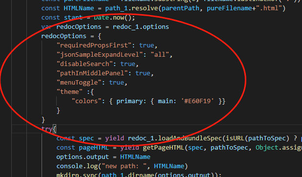
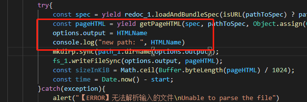

# redoc_cli_electron

#### 介绍
redoc 是封装了redoc-cli的electron app，用于将符合openapi规范的json和yaml(目前仅支持apicurio导出的json和yaml文件)转换成html的api文档
> 本人前端技术较差，不会写界面
#### 软件架构
没啥架构，就是一个组内使用的小工具，权当练手了

redoc-cli需要将bundle方法导出，需要修改源码，就直接把这个包拷贝出来改了

#### 安装教程

1. 首先进入redoc-cli目录，运行`npm install --dependencies`，先安装redoc-cli的依赖
2. 回到根目录，运行`npm install --dependencies`，安装本服务的依赖
3. 运行`npm run make`打包
4. 在 `out`目录下找到打包的exe文件

在这里自定义导出html的样式【具体见redoc options对象 https://www.npmjs.com/package/redoc#redoc-options-object】

这里修改导出路径

模板文件在目录`redoc-cli`下，可替换`template.hbs`
> 懂得都懂

#### 使用说明

1.  将从apicurio导出的json和yaml文件拖到窗口
2.  就会在json和yaml的同级目录下生成同名的html文档

